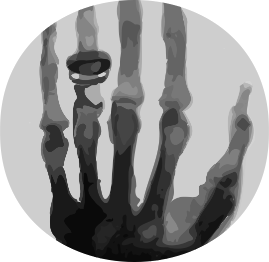

========
Overview
========

.. start-badges

.. list-table::
    :stub-columns: 1

    * - docs
      - |docs|
    * - build status
      - |build| |coverage|
    * - package
      - |version| |downloads| |wheel|

.. |docs| image:: https://readthedocs.org/projects/roentgen/badge/?version=latest
    :target: https://roentgen.readthedocs.io/en/latest/?badge=latest
    :alt: Documentation Status

.. |build| image:: https://circleci.com/gh/ehsteve/roentgen.svg?style=svg
    :target: https://circleci.com/gh/ehsteve/roentgen
    :alt: Build Status

.. |coverage| image:: https://coveralls.io/repos/github/ehsteve/roentgen/badge.svg?branch=master
    :target: https://coveralls.io/github/ehsteve/roentgen?branch=master
    :alt: Coverage Status

.. |version| image:: https://img.shields.io/pypi/v/roentgen.svg?style=flat
    :alt: PyPI Package latest release
    :target: https://pypi.python.org/pypi/roentgen

.. |downloads| image:: https://img.shields.io/pypi/dm/roentgen.svg?style=flat
    :alt: PyPI Package monthly downloads
    :target: https://pypi.python.org/pypi/roentgen

.. |wheel| image:: https://img.shields.io/pypi/wheel/roentgen.svg?style=flat
    :alt: PyPI Wheel
    :target: https://pypi.python.org/pypi/roentgen

.. end-badges

A Python package for the quantitative analysis of the interaction of energetic x-rays with matter.
This package is named after one of the discoverers of X-rays, `Wilhelm Röntgen <https://en.wikipedia.org/wiki/Wilhelm_Röntgen>`_.

Installation
============

::

    pip install roentgen

Documentation
=============

http://roentgen.readthedocs.io/en/latest/

GUI
===
This package provides a gui interface to quickly investigate the absorption
and transmission of x-rays through different materials. It is based on
`bokeh <https://docs.bokeh.org/en/latest/>`_. A working version
of the GUI can be found installed on `heroku <https://www.heroku.com>`_.

https://roentgen-gui.herokuapp.com/gui

To run it locally use the following command

::
   
   bokeh serve --show <roengten_directory>/gui

Data Sources
============
This package includes on a number of data files which were
translated and imported from a few key sources. The package
developers would like to thank the following data providers

* The U.S National Institute of Standards and Technology (NIST)
* The Center for X-ray Optics and Advanced Light Source at the Lawrence Berkeley National Laboratory

For more information see the README in data directory.
