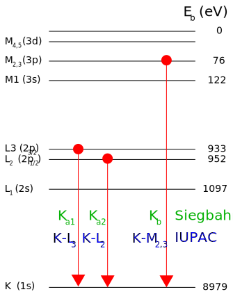

Emission Lines
==============

Characteristic radiation come from interactions between a
high-energy particle, such as an electron, and an orbital electron in an atom. These
interactions or collisions can, if the energy of the incoming electron is greater
than the binding energy of the orbital electron, kick out the electron and leave
a vacancy. An electron from a high energy level can move down to fill the vacancy.
In the process, it gives up energy which is emitted in the form of a photon. For
inner orbitals vacancies, these photons are generally in the x-ray regime.
This process is schematically shown in the diagram below.

There are two notations used to refer to these transitions. Siegbahn notation
has historically been used in the area of X-ray spectroscopy. Though still
widely used, it has been replaced by a newer nomenclature recommended by
the International Union of Pure and Applied Chemistry (IUPAC). It is referred to here
as IUPAC notation. The correspondence between these two nomenclatures is shown
in the table below.

.. csv-table:: Emission line translation
    :file: ../../roentgen/data/siegbahn_to_iupac.csv
    :widths: 30, 70
    :header-rows: 1

For a more full listing see Table VIII.2 in `IUPAC Report <http://old.iupac.org/reports/V/spectro/partVIII.pdf>`_.

The energies of the x-rays from these transitions are unique to each element
and are provided by a number of sources. This package makes use of those provided
by the `X-ray Data Booklet (October 2009) <https://xdb.lbl.gov>`_. It provides
energies in `Table 1-3 <https://xdb.lbl.gov/Section1/Table_1-3.pdf>`_ as well as
relative intensities. More precise transition energies can be found at the `NIST X-ray transition
energies database <https://physics.nist.gov/PhysRefData/XrayTrans/Html/search.html>`_.

The full table of energies is provided in::

   from roentgen import emission_lines

It is possible to search for all known characteristic lines in an energy range
with::

    >>> import astropy.units as u
    >>> from roentgen.lines import get_lines
    >>> lines = get_lines(5 * u.keV, 5.2 * u.keV)
    >>> print(lines)
    energy  z  transition intensity
      eV
    ------ --- ---------- ---------
    5013.5  59        Lα2        11
    5033.7  59        Lα1       100
    5034.0  54        Lγ1         8
    5042.1  57        Lβ1        60
    5156.5  56     Lβ2,15        20
    5177.2  63         Ll         4

If you are only interested in lines from a particular element, the search can
be limited with::

    >>> import astropy.units as u
    >>> from roentgen.lines import get_lines
    >>> ni_lines = get_lines(5 * u.keV, 10 * u.keV, element='Ni')
    >>> print(ni_lines)
    energy  z  transition intensity
      eV
    ------ --- ---------- ---------
    7460.9  28        Kα2        51
    8264.7  28      Kβ1,3        17
    7478.2  28        Kα1       100

